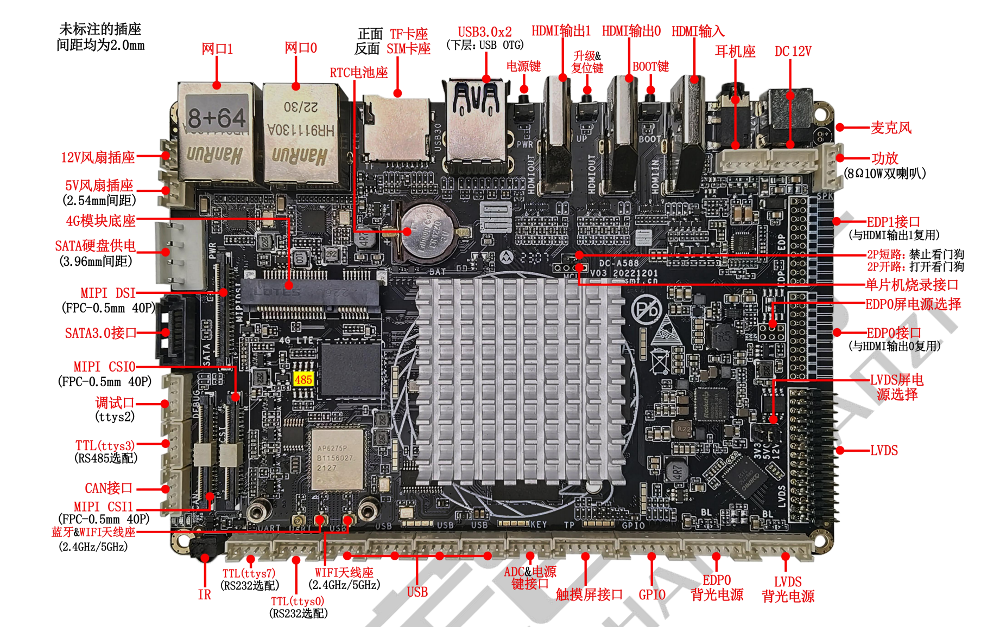

# DC-A588 (Rockchip RK3588) 玩耍记录

```
Something I hope you know before go into the coding~
First, please watch or star this repo, I'll be more happy if you follow me.
Bug report, questions and discussion are welcome, you can post an issue or pull a request.
```

## 相关站点

* 定昌官网介绍页面: <https://www.gzdcsmt.com/sys-pd/166.html>
* 定昌官网WIKI: <http://wikicn.gzdcsmt.com/wendang_id_8.html>
* 定昌官方B站: <https://space.bilibili.com/514513449/upload/video>

## 开发板信息

- CPU	RK3588，八核 64 位(4xCortex-A76+4xCortex-A55)，8nm 先进工艺，主频最高 2.4GHz
- GPU	ARM Mali-G610 MP4 四核 GPU,支持 OpenGL ES3.2 / OpenCL 2.2 / Vulkan1.1, 450 GFLOPS，NPU 算力高达 6 TOPS，支持 INT4/INT8/INT16 混合运算
- NPU	可实现基于 TensorFlow / MXNet / PyTorch / Caffe 等系列框架的网络模型转换
- 运行内存	4GB/8GB/16GB 64bit LPDDR4/LPDDR4x/LPDDR5 （最高可配 32GB）
- 内部存储器	eMMC 16(默认)/32G/64G/128G
- 存储器扩展	最高支持 128GB 的 TF 卡扩展
- 显示接口	
- HDMI IN 接口	1 个，最大支持分辨率 4K
- HDMI OUT 接口	2 个，最大支持分辨率 8K（可通过MIPIDSI转接板实现3个HDMI OUT输出）
- LVDS 接口	1 个，最大支持分辨率 1080P
- EDP 接口	2 个，最大支持分辨率 4K
- MIPI DSI 接口	1 个，最大支持分辨率 4K
- 音频接口	
- 耳机座接口	1 路麦克风单声道输入（模拟信号输入），1 路音频双声道输出（模拟信号输出）
- 麦克风接口	1 路麦克风单声道输入（模拟信号输入）
- 功放接口	左右双声道输出，支持 8Ω 10W 双喇叭
- 网络支持	
- 以太网	2 个标准 RJ45 接口，10/100/1000M 自适应以太网
- WIFI/蓝牙	板载 WIFI/BT 模块，支持 WiFi 2.4GHz/5GHz 双频 WiFi6（选配），支持 802.11a/b/g/n/ac，协议，支持 Bluetooth 5.0（支持 BLE）
- 移动网络	1 个内置 MINI PCI_E 座插槽，拓展连接 3G/4G 模块
- 基本接口	
- USB	5 个 USB Host 接口（4 个 2.0mm-4P 插座，1 个外置标准 USB3.0 座子），用于外接高清 USB摄像头、U 盘、键盘鼠标等设备
- USB OTG	1 个 USB OTG 接口用于调试系统，更新固件，也可设置为 Host 模式
- 串口	4 路串口，其中 3 路 TTL 串口（1 路可选配 RS485 串口，2 路可选配 RS232 串口），1 路调试口
- 板载 RTC	支持实时时钟，1220 纽扣电池供电
- MIPI 摄像头	支持双 MIPI 摄像头输入
- 红外接收	1 路红外接收头，支持红外遥控功能
- 其他	
- 操作系统	Android 12/鸿蒙4.12/银河麒麟v10sp1/星光麒麟1.0/debian11/ubuntu20.04桌面版与服务器版本
- 电源插座	1 个外置 DC12V 输入插座（DC-5.5*2.5MM 母座）
- 建议电源规格	12V 2-5A（根据外设功率选择）
- 系统升级	支持 PC/U 盘/TF 卡升级
- 工作环境	
- 工作温度	商业级：0℃～70℃，工规级：-20℃～80℃
- 工作湿度	10％～90％，无凝露
- 存储温度	-30℃～75℃，推荐常温下存储





## 高透亚克力外壳


* 外壳购买方式: 扫描上图二维码，跳转闲鱼购买
    - 高透亚克力材质
    - 支持2.5寸硬盘，预留孔位
    - 支持6cm散热风扇，预留孔位(**主动散热比铁壳散热效果好**)
    - 外壳厚度5mm
    - 带m3铜柱，结实稳固
    - 预留ttl串口调试线孔位

## 固件获取及刷机方式

* <https://github.com/yifengyou/dc-a588/releases>

请参看官方WIKI及固件下载页面的说明操作即可


## 定昌官方B站信息

* <https://space.bilibili.com/514513449>


---


